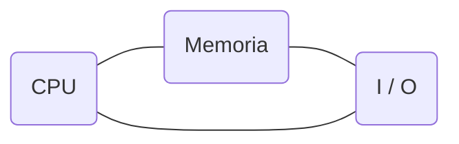

# ¿Cómo funciona un ordenador?
> [!NOTE]
> El contenido de esta parte es una simplificación del contenido que se da en las asignaturas [[estru-arqui|Estructura de Computadores y Arquitectura de Computadores]] que son asignaturas de segundo. Sin embargo solo cogemos las partes básicas y más relevantes para entender qué estamos haciendo cuando programamos exactamente.

Un computador según [Von Newmann](https://en.wikipedia.org/wiki/John_von_Neumann) se compone de 3 partes:



Las tres partes son:
 - Una CPU (_Central Processing Unit_) que hace las operaciones.
 - Una memoria (RAM) que guarda los datos que están en uso.
 - Una unidad de Input/Output para comunicarse con el exterior.

Para esta pequeña introducción, sin embargo, solo nos interesa la CPU (Unidad de Procesamiento Central). La CPU es un complejo circuito de transistores que forman puertas lógicas que juntas pueden calcular ciertas operaciones: suma, resta, multiplicación. Estas operaciones se aplican sobre secuencias de números binarios (0 y 1) que en realidad son pulsos eléctricos.

El camino desde circuitos electrónicos hasta una CPU capaz de interpretar cadenas de 0s y 1s y producir resultados se intenta explicar entre las asignaturas de [[fisica|Física]] y [[ssdig|Sistemas Digitales]] 

Además, la CPU es capaz de elegir qué operación hacer en base a la cadena de 1s y 0s que recibe. La CPU por tanto es capaz de interpretar cadenas binarias y producir un resultado.

En el fondo las instrucciones que le damos a un ordenador son cadenas de 1s y 0s que codifican una información. Esa información suele estar en una forma similar a la siguiente:

```
[ 1010 1010 ] [ 0000 0001 ] [ 0000 0010 ]
[ Operación ] [ Operando1 ] [ Operando2 ]
```

Como es obvio, es muy complicado entender qué estamos haciendo cuando solo podemos leer 1s y 0s, por tanto existen 'proto-lenguajes' que hacen que estas lineas de binario sean más fáciles de entender. Estos lenguajes son lo que llamamos [[ensamblador]].


[[indice|Volver al índice]] | [[razonamiento-introduccion|¿Por qué es esto importante?]] | [[ensamblador|Siguiente lección]]