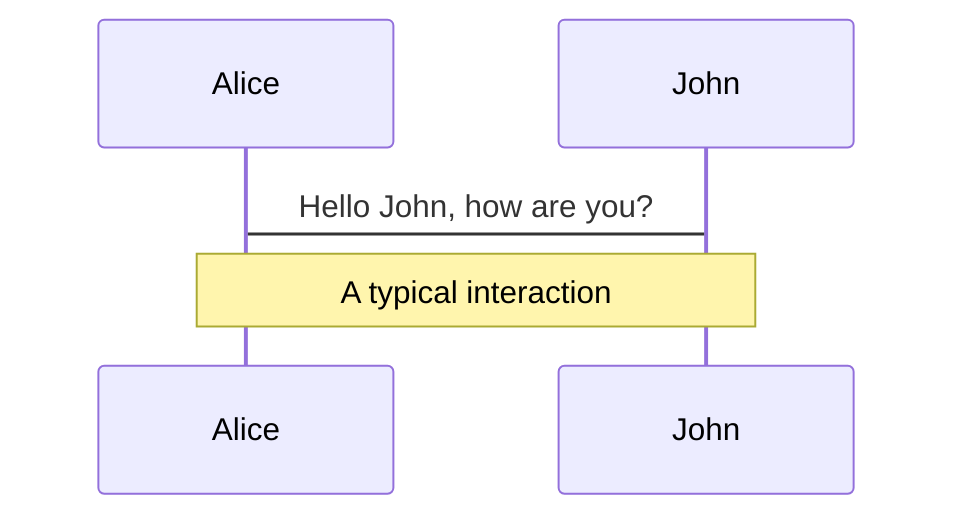
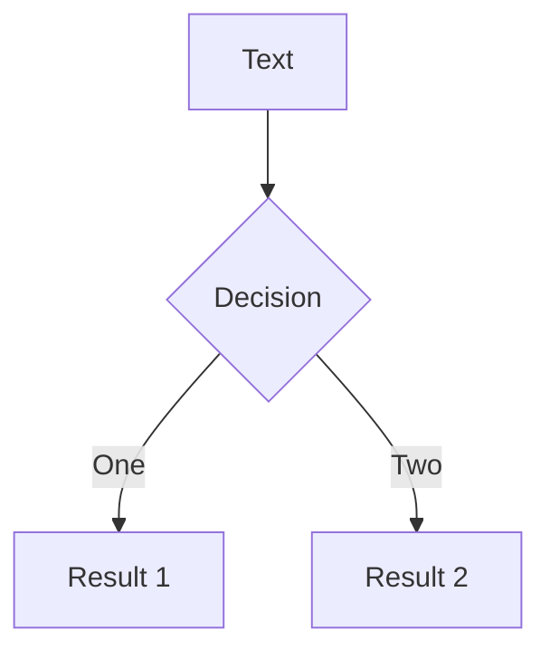
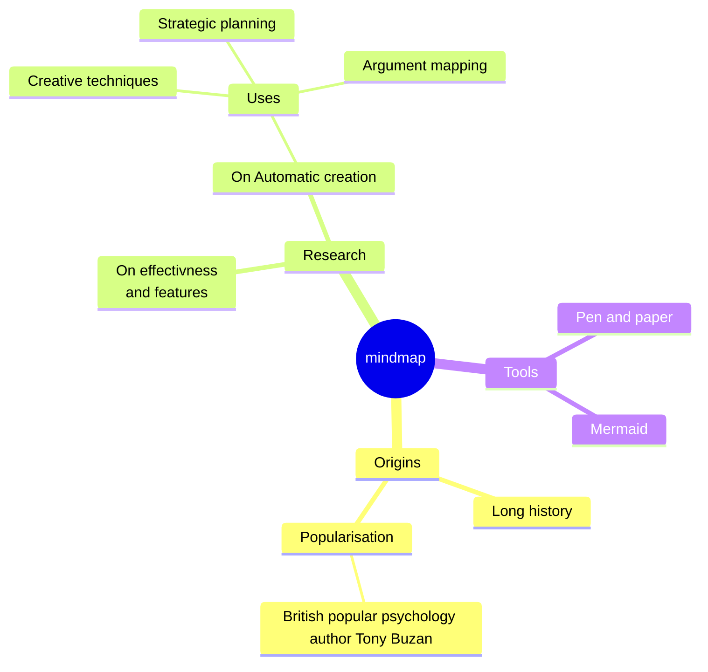
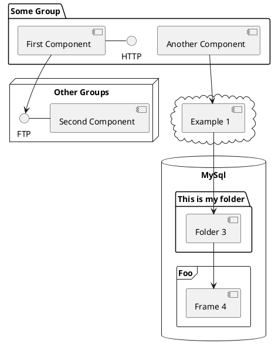

## [ACM]
# **Introdución a la programación**

¿Qué significa programar y cómo hacerlo bien?

Borja Martinena

<style>
    h1 {
      background-image: linear-gradient(to right bottom, #d48d8d, #de94a1, #e69db7, #e9a7ce, #e9b3e4);
      background-size: 100%;
      -webkit-background-clip: text;
      -moz-background-clip: text;
      -webkit-text-fill-color: transparent;
      -moz-text-fill-color: transparent;
  padding-bottom: 1rem;
    }
</style>
<!--
Introduccíon:
- ¿Qué es ACM?
- ¿Quien soy yo?
- ¿Qué vamos a dar en el curso?
-->
---
layout: center
class: text-center
---

# Material

<br>

https://github.com/aafrecct/acm-curso-progra

<br>

https://play.nim-lang.org/

---

# **Índice**

<v-clicks>

1. **¿Qué es programar?**
    - ¿Cómo funciona un ordenador? 
    - Ensamblador
    - ¿Qué es compilar?

2. **Elementos básicos de la programación imperativa**
    - Números
    - Strings
    - Condiciones
    - Bucles
    - Colecciones
    - Funciones

</v-clicks>

---

# **Índice**

<v-clicks>

3. **Otros conceptos importantes de programación**
    - Tipos
    - Null
    - Errores y excepciones

4. **Java** 
    - Estructura básica del código
    - Tipos
    - Control de flujo
    - Bucles
    - Funciones

</v-clicks>

---

### PARTE 1
# **¿Qué es programar?**

<br>

- **Transistores** a partir de material semiconductor.
- **Puertas lógicas** a partir de transistores.
- **Operaciones binarias** a partir de puertas lógicas.
- **Procesadores de instrucciones** combinando operaciones binarias.
- **Lenguajes simbólicos** para escribir instrucciones para un procesador.
- **Lenguajes de alto nivel** que se traducen a lenguajes ensamblador.

<!--
Mencionar asignaturas: Física, Sistemas Digitales, Estructura y Arquitectura y PDL.
-->

---
level: 2
---

# Programación en Ensamblador

<br>
<br>

### Binario

```
10101010 00001000 00100010
11001000 00000000 01001010
```

<br>
<br>

### Ensamblador

```
add 8 34
mov r0 #10
```
<span class="lang">assembly</span>

---
level: 2
---

# Código de alto nivel

<br>
<br>

```nim
var 
    naranjas: int = 1000;
    limones: int = 2000;
    frutas: int = naranjas + limones;

echo "Hay un total de ", frutas, " frutas."
```
<span class="lang">nim</span>

---
layout: section
---

# **Aprendamos a programar**

---
layout: quote
level: 2
---

### Números

```nim
var numero_naranjas = 2000
var nota_programacion_1 = 10
```
<span class="lang">nim</span>

---
layout: quote
level: 2
---

### Números

```nim {all|1|2|3}
var a: int8 = 128
var b: int64 = 100000000
var c: float32 = 3.14
```
<span class="lang">nim</span>

---
layout: quote
level: 2
---

### Números

```nim
var numero: int8 = 129
echo numero
```
<span class="lang">nim</span>

<br>

<v-click>

```
-127
```

</v-click>

---
layout: quote
level: 2
---

### Números

```nim
var a: int = 32
var b: int = 8

# Prueba los siguientes operadores: + - * / mod
var resultado = a * b
echo resultado
```
<span class="lang">nim</span>

<br>

<v-click>

```
256
```

</v-click>

---
layout: quote
level: 2
---

### Strings

```nim
var saludo: string = "hola mundo"
```
<span class="lang">nim</span>

---
layout: quote
level: 2
---

### Strings

<div class="overflow-scroll ">

| Posición en mem. | Datos en mem.   | Letra representada |
|:----------------:|:----------------|:------------------:|
| 00               | `01101000` (104)| h                  |
| 01               | `01101111` (111)| o                  |
| 02               | `01101100` (108)| l                  |
| 03               | `01100001` (97) | a                  |
| 04               | `00100000` (32) | \<espacio\>        |
| 05               | `01101101` (109)| m                  |
| 06               | `01110101` (117)| u                  |
| 07               | `01101110` (110)| n                  |
| 08               | `01100100` (100)| d                  |
| 09               | `01101111` (111)| o                  |
| 10               | `00000000` (0)  | \<null\>           |

</div>

---
layout: quote
level: 2
---

### Strings

```rust
let saludo: &str = "hola mundo";
let mut saludo_2: String = String::from("hola a todos");
```
<span class="lang">rust</span>

---
layout: quote
level: 2
---

### Strings

```nim
var a: string = "Las cadenas son secuencias de "
var b: string = "caracteres"
var c: char   = 'a'

echo a & b
echo c in a
```
<span class="lang">nim</span>

<br>

<v-click>

```
Las cadenas son secuencias de caracteres
true
```

</v-click>

---
layout: quote
level: 2
---

### Booleanos

```nim
var a: bool = true
```
<span class="lang">nim</span>

---
layout: quote
level: 2
---

### Booleanos

``` nim
echo 2005 > 2001
echo 9 == 11
echo 't' in "torre"
```
<span class="lang">nim</span>

<br>

<v-click>

```
true
false
true
```

</v-click>

---
layout: quote
level: 2
---

### Condiciones

```nim
var numero: int = 1945

if numero mod 2 == 0:
  echo "PAR"
else:
  echo "IMPAR"
```
<span class="lang">nim</span>

<br>

<v-click>

```
IMPAR
```

</v-click>

---
layout: default
level: 2
---
### Bucles

``` nim
var i: int = 0
var j: int = 1

echo i
echo j

i = i + j
echo i
j = j + i
echo j
i = i + j
echo i
j = j + i
echo j
i = i + j
echo i
j = j + i
echo j
i = i + j
echo i
j = j + i
echo j
i = i + j
echo i
j = j + i
echo j
i = i + j
echo i
j = j + i
echo j
i = i + j
echo i
j = j + i
echo j
i = i + j
echo i
j = j + i
echo j
i = i + j
echo i
j = j + i
echo j
i = i + j
echo i
j = j + i
echo j
i = i + j
echo i
j = j + i
echo j
i = i + j
echo i
j = j + i
echo j
...
```

---

# LaTeX

LaTeX is supported out-of-box powered by [KaTeX](https://katex.org/).

<br>

Inline $\sqrt{3x-1}+(1+x)^2$

Block
$$
\begin{array}{c}

\nabla \times \vec{\mathbf{B}} -\, \frac1c\, \frac{\partial\vec{\mathbf{E}}}{\partial t} &
= \frac{4\pi}{c}\vec{\mathbf{j}}    \nabla \cdot \vec{\mathbf{E}} & = 4 \pi \rho \\

\nabla \times \vec{\mathbf{E}}\, +\, \frac1c\, \frac{\partial\vec{\mathbf{B}}}{\partial t} & = \vec{\mathbf{0}} \\

\nabla \cdot \vec{\mathbf{B}} & = 0

\end{array}
$$

<br>

[Learn more](https://sli.dev/guide/syntax#latex)

---

# Diagrams

You can create diagrams / graphs from textual descriptions, directly in your Markdown.

<div class="grid grid-cols-4 gap-5 pt-4 -mb-6">









</div>

[Learn More](https://sli.dev/guide/syntax.html#diagrams)

---
src: ./pages/multiple-entries.md
hide: false
---

---
layout: center
class: text-center
---

# Learn More

[Documentations](https://sli.dev) · [GitHub](https://github.com/slidevjs/slidev) · [Showcases](https://sli.dev/showcases.html)
